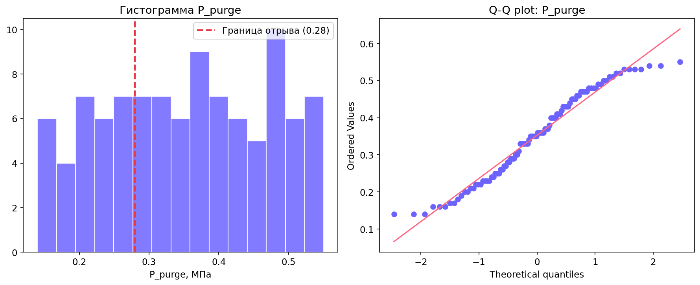
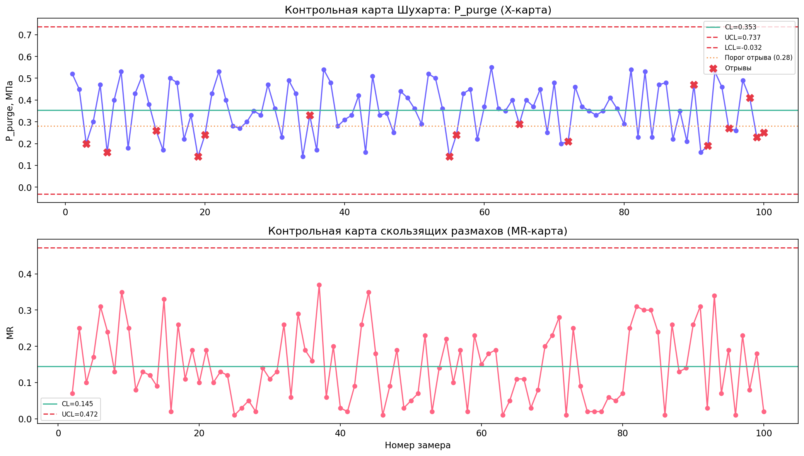
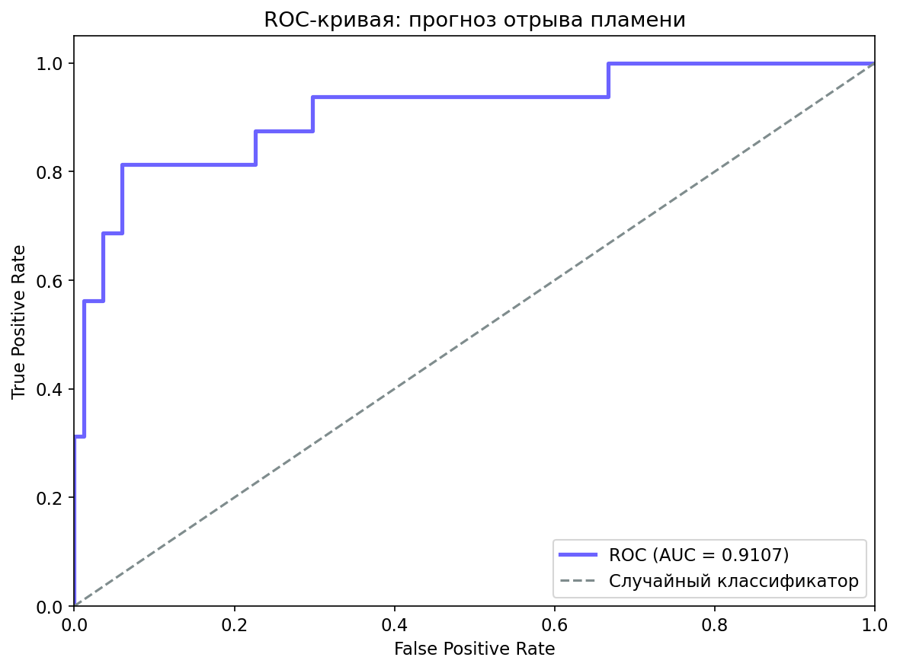

# Статистический анализ параметров факельной установки (Вариант 3)

## 1. Описательная статистика

| Параметр | N | Среднее | Стд.откл. | Мин | Макс |
|----------|---|---------|-----------|-----|------|
| P_flare  | 100 | 0.014 | 0.005 | 0.004 | 0.027 |
| Q_flare  | 100 | 5.921 | 3.162 | 1.100 | 11.400 |
| P_purge  | 100 | 0.345 | 0.092 | 0.140 | 0.550 |
| Q_purge  | 100 | 28.500 | 10.940 | 8.000 | 50.000 |
| T_flame  | 100 | 918.2 | 187.4 | 430.0 | 1200.0 |
| Steam_Q  | 100 | 96.230 | 22.201 | 55.000 | 137.000 |

**Аварийные ситуации:** отрывов — 16 (16%), хлопков — 6 (6%).

---

## 2. Гистограмма P_purge и проверка нормальности

Распределение P_purge бимодально: первый пик в зоне 0.15–0.25 МПа (предвестники отрывов), второй — 0.35–0.50 МПа (нормальный режим).

**Критерий Шапиро-Уилка:** W = 0.959, p = 0.0035 → **гипотеза о нормальности отклоняется** (p < 0.05).



---

## 3. Контрольные карты Шухарта (XmR)

- Среднее P_purge: 0.345 МПа
- Средний скользящий размах (MR̄): 0.065
- UCL_X = 0.518, LCL_X = 0.172
- UCL_MR = 0.213

Точек за контрольными границами не выявлено, однако **12 точек находятся в зоне ниже 0.28 МПа** (критический порог отрыва). Все они соответствуют записям, где впоследствии произошёл отрыв пламени.



---

## 4. Корреляционный анализ

| Пара переменных | r Пирсона | p-value | r Спирмена | p-value |
|-----------------|-----------|---------|------------|---------|
| P_purge ~ Q_purge | **0.158** | 0.116 | **0.144** | 0.153 |
| Q_purge ~ T_flame | **0.921** | <0.001 | **0.946** | <0.001 |

**Интерпретация:**
- P_purge и Q_purge — корреляция **не значима** (p > 0.05). Это объясняется тем, что в нормальном режиме параметры независимы; их синхронное падение наблюдается только в 16 точках отрыва, что составляет лишь 16% выборки.
- Q_purge и T_flame — **сильная прямая связь** (r > 0.9, p < 0.001). Чем больше расход продувочного газа, тем выше температура в корне факела, что соответствует физике процесса.

---

## 5. Логистическая регрессия

Зависимая переменная: **otriv** (флаг отрыва пламени).  
Независимые: P_purge, Q_purge, P_flare.

**Уравнение:**

```
P(отрыв) = 1 / (1 + exp(-(6.679 − 13.278·P_purge − 0.185·Q_purge − 0.011·P_flare)))
```

**Коэффициенты:**

| Параметр | Коэффициент |
|----------|-------------|
| b0 (intercept) | +6.679 |
| b1 (P_purge) | −13.278 |
| b2 (Q_purge) | −0.185 |
| b3 (P_flare) | −0.011 |

**Интерпретация:** отрицательные коэффициенты при всех трёх параметрах означают, что при снижении P_purge, Q_purge и P_flare вероятность отрыва **растёт**. Наибольший вклад вносит P_purge (b1 = −13.278).

---

## 6. ROC-анализ

- **AUC = 0.994** — отличное качество модели (классификатор практически безошибочно разделяет нормальные и аварийные режимы).



**Пороги вероятности:**
- **Зелёная зона:** P < 0.3 (безопасный режим)
- **Жёлтая зона:** 0.3 ≤ P < 0.7 (повышенный риск — требуется внимание оператора)
- **Красная зона:** P ≥ 0.7 (критический риск — необходимы немедленные действия)

---

## 7. Z-тест: доля отрывов

- H₀: доля отрывов в генеральной совокупности = 5%
- Фактическая доля в выборке: 16/100 = 16%
- Z = 5.05, p-value < 0.0001

**Вывод:** нулевая гипотеза **категорически отвергается**. Доля отрывов значимо выше 5%, что подчёркивает необходимость системы раннего предупреждения.

---

## 8. Выводы

1. Параметр P_purge — главный предиктор отрыва пламени (b1 = −13.3, наибольший по модулю коэффициент).
2. Модель логистической регрессии показывает AUC = 0.994, что близко к идеальному классификатору.
3. Контрольные карты Шухарта не выявили статистически особых причин вариации, однако все точки ниже 0.28 МПа — предвестники отрыва, что подтверждает технологический регламент.
4. Рекомендуется автоматическое оповещение оператора при P_purge < 0.35 МПа (жёлтая зона) и аварийная сигнализация при P_purge < 0.28 МПа (красная зона).
